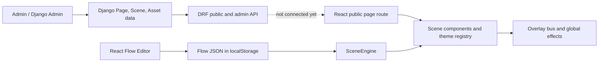

# PixelPopup - Project Context

Last reviewed: 2026-07-25

The visual/component rules for future work are in [`DESIGN_GUIDELINES.md`](DESIGN_GUIDELINES.md).

## What this project appears to be

PixelPopup is an interactive, shareable web-experience platform. The intended product is a small studio/admin system for creating personalized pages for occasions such as date invitations, weddings, birthdays, proposals, timelines, maps, quizzes, letters, and mini-games.

The creator/admin manages a page and its content. A recipient visits a public slug URL and experiences a themed, highly interactive React page. The visual language is intentionally playful and retro: pixel/desktop-window UI, bold borders and shadows, stickers, sound effects, CRT/VHS/glitch effects, confetti, and animated overlays.

The repository currently contains both:

- a fairly complete Django content/admin backend design; and
- a React prototype/runtime with several hard-coded demos and a browser-local flow editor.

My current interpretation is that the project is between prototype and productization: the authoring/runtime ideas are present, but the backend content model is not yet wired to the frontend public renderer.

## High-level architecture



### Backend: `backendv2/`

The backend is a Django 5 project using Django REST Framework, SQLite for development, session/basic authentication, CORS, and JSON editor widgets in Django Admin.

Important backend layers:

- `backendv2/core/` - Django project settings and URL configuration.
- `backendv2/pixelpopup/models.py` - database/domain model.
- `backendv2/pixelpopup/admin.py` - primary authoring UI today; Page embeds Scene and Asset editing, and ClientRequest embeds Payment editing.
- `backendv2/pixelpopup/api/views.py` - public page/password endpoints and staff-only CRUD/actions.
- `backendv2/pixelpopup/api/serializers.py` - API representation plus DB-aware scene reference validation.
- `backendv2/pixelpopup/api/validation.py` - structural JSON schema validation for scene payloads.
- `backendv2/pixelpopup/api/preflight.py` - publish safety checks without mutating the database.
- `backendv2/pixelpopup/api/template_io.py` - JSON template export/import.
- `backendv2/pixelpopup/management/commands/clone_page.py` - command-line page cloning.

#### Core data model

```text
ClientRequest 1 --- * Payment
ClientRequest 0..1 --- 1 Page
Page 1 --- * Scene
Page 1 --- * Asset
```

- `Page` is the publishable experience: slug, title, draft/published/archived status, password/expiry, theme ID/settings, page variables, and optional renderer metadata.
- `Scene` is an ordered page section. It has a stable per-page key, a type, JSON data, optional renderer metadata, and optional theme override.
- `Asset` is a page-owned uploaded file (image, video, audio, GIF, or other) with metadata.
- `ClientRequest` and `Payment` are the business/operations layer for accepting paid custom-experience work.

#### Backend content contract

Scene JSON is intentionally schema-driven. Supported scene types are:

`motion`, `question`, `choice`, `timeline`, `letter`, `map`, `exploration`, and `finale`.

Scene data can contain backgrounds, audio, objects, and type-specific blocks. Objects have stable IDs, layout/state/motion/content, and event triggers. Triggers dispatch controlled actions such as opening/revealing objects, going to another scene, branching, playing media, changing text/images/variables, screen effects, confetti, and ending the experience.

Validation happens at multiple boundaries:

1. Structural validation checks allowed keys, types, required blocks, trigger events, actions, and action-specific fields.
2. Serializer validation checks that referenced asset IDs and scene keys belong to the same Page and that action target IDs exist in the scene objects.
3. Page preflight repeats these checks across every scene before publishing.

#### Backend API surface

Public:

- `GET /api/public/pages/<slug>/` - returns a published, non-expired page payload, or a password-required shell.
- `POST /api/public/pages/<slug>/verify-password/` - verifies a password and returns the full page payload.

Staff-only CRUD/action endpoints are registered under `/api/admin/` for pages, scenes, assets, client requests, and payments. Page actions include preflight, publish, export, and template import.

### Frontend: `pixelpopup-frontend/`

The frontend is a React 19 + Vite app styled with Tailwind CSS and custom CSS variables. It uses React Router, Framer Motion, React Flow, Zustand, Zod, Mapbox GL, `html-to-image`, Lucide icons, and canvas-confetti.

Entry points:

- `src/main.jsx` mounts the app and global CSS.
- `src/App.jsx` defines the current routes.
- `src/ui/retro/` contains the reusable retro/pixel component kit.
- `src/ui/overlay/` contains the global event bus, modal/toast/loading host, stickers, audio, confetti, CRT/VHS/glitch, cursor trail, and background effects.
- `src/engine/` contains the flow runtime, scene registry, authored flow storage, demo flows, and graph editor.
- `src/features/date-planner/` is a substantial standalone invitation/date-planning experience driven by `datePlannerConfig.js`.
- `src/ui/scenes/wedding/` contains wedding-specific scene components and configuration helpers.

Current routes in `src/App.jsx`:

| Route | Purpose |
| --- | --- |
| `/date-planner` | Current default; renders the config-driven date invitation/planner. |
| `/scene-engine` | Runtime demo with flow devtools; defaults to the wedding flow. |
| `/flow-editor` | React Flow graph editor plus SceneEngine preview. |
| `/demo-all` | Mega demo of the reusable scene engine panels. |
| `/portfolio` | Retro portfolio page. |
| `/ui` | UI kit page. |
| `/overlay-playground` | Overlay/effects playground. |
| `/` and unknown paths | Redirect to `/date-planner`. |

#### Frontend flow runtime

The active runtime in `src/engine/SceneEngine.jsx` expects a flow shaped approximately like:

```js
{
  id: "flow-id",
  start: "node-id",
  nodes: {
    "node-id": {
      scene: "TypewriterPanel",
      props: {},
      mutations: [],
      on: {
        primary: "next-node",
        choice: { to: "other-node", when: { var: "x", eq: "yes" } }
      }
    }
  }
}
```

The runtime owns the current node and mutable `vars`. It applies mutations on node entry and transitions, evaluates guards, and injects event handlers into scene components. `flowRunTime.js` supports token replacement and mutations such as set, merge, increment, toggle, push, remove, and unset.

`sceneRegistry.js` and the `SCENES` map in `SceneEngine.jsx` connect flow scene names to React components. This gives the project a useful component-registry approach for reusable scene types and custom experiences.

The browser authoring layer in `src/engine/authoring/` stores authored flows in `localStorage` under `pp:flows:*`, supports schema version `1`, validates only the basic flow shape, and can export/import JSON. `FlowGraphEditor.jsx` presents those flows as React Flow nodes and edges.

There is also an older/parallel scene utility in `src/engine/sceneEngine.js` that expects `flow.scenes[]`, `scene.next`, and `scene.branches`. The actual React runtime currently uses `flow.nodes`, so this utility should be treated as legacy or an alternate contract until consolidated.

## The most important current boundary

The backend and frontend do not currently share a live content pipeline.

- The backend models a page as `Page -> Scene -> Asset`, with scene types and JSON data designed for a future schema renderer.
- The frontend demos mostly use imported JavaScript flow objects, the date planner config, and direct remote/local asset URLs.
- A repository search found no frontend `fetch`/Axios call to `/api/public/pages/...` and no route that resolves a public slug into backend data.
- The frontend flow schema (`nodes`, `scene`, `props`, `on`, `mutations`) is different from the backend scene schema (`type`, `data.objects`, `data.triggers`, `go_to_scene`, etc.).

This is not necessarily a problem for the prototype, but it is the main architectural decision still outstanding. The system needs one canonical authoring/rendering contract or an explicit adapter between the two.

## Suggested integration direction

The lowest-risk path is to keep the backend as the source of truth for delivered pages and add an adapter at the frontend boundary:

1. Add a public React route such as `/p/:slug`.
2. Fetch the published page from the public API and handle the three states: loading, password required, and full page.
3. Resolve `Asset` IDs to the serialized `file_url` values.
4. Convert backend scenes into the frontend runtime format, or introduce a backend-scene renderer that consumes the existing `Scene.data` contract directly.
5. Map backend `renderer.component_key` values to the existing scene registry for custom React overrides.
6. Preserve page variables/theme settings as runtime context.
7. Keep the localStorage flow editor as a prototyping tool until it can save/export the canonical backend format.

The adapter approach lets the existing demos continue to evolve while making the public delivery path database-backed. It also avoids silently maintaining two independent authoring systems.

## Current strengths

- The backend has a clear publish lifecycle and rejects invalid/incomplete pages before publishing.
- Scene JSON is controlled instead of being completely arbitrary.
- Asset and scene reference checks reduce broken links inside an experience.
- Page cloning and template export/import are good foundations for a reusable product workflow.
- The frontend has a strong visual identity and a reusable retro UI/effects layer.
- `SceneEngine` already supports guarded transitions, variables, mutations, and reusable scene components.
- Wedding and date-planner examples demonstrate that the system can support both schema-like flows and highly custom experiences.

## Current risks and gaps

### Product/integration

- No public slug-driven React page renderer is wired to the backend yet.
- Backend scene JSON and frontend flow JSON are two different contracts.
- `template_io.py` explicitly does not remap asset IDs during import; imported scenes can retain references to the original page's asset IDs.
- Custom renderer metadata exists in the backend, but there is not yet a documented frontend resolver for `component_key`/props.
- Analytics, password-attempt tracking, a separate web admin UI, and JWT auth are not implemented.

### Frontend quality baseline

- `npm run build` succeeds, but reports a JSX warning in `src/features/date-planner/DatePlanner.jsx` and a large main bundle warning.
- `npm run lint` currently fails with 99 errors and 18 warnings. Notable categories include hook-order/static-component errors, unused imports/variables, empty catch blocks, React compiler rules, and a parsing error in the date planner footer.
- `SceneEngine.jsx` currently calls a `useMemo` after early returns for missing/unknown scenes; this is a real Rules of Hooks issue and should be fixed before relying on the engine in production.
- The default app currently redirects to a demo/date-planner experience rather than a backend page.

### Backend hardening

- `backendv2/core/settings.py` still has `DEBUG = True`, a hard-coded development secret key, and an empty `ALLOWED_HOSTS` list.
- The checked-in development database is SQLite. Production deployment should use environment-based settings and likely Postgres/object storage for assets.
- Public password verification is intentionally minimal and has no visible rate limiting or attempt logging.
- CORS and CSRF settings are development-oriented and should be environment-driven before deployment.

## Useful development commands

Frontend, from `pixelpopup-frontend/`:

```bash
npm run dev
npm run build
npm run lint
npm run preview
```

Backend, from `backendv2/` with the project virtualenv active:

```bash
python manage.py runserver
python manage.py check
python manage.py migrate
python manage.py createsuperuser
python manage.py clone_page <page_id> --copy-assets
```

## Working conventions for future changes

- Treat `backendv2/pixelpopup/models.py` and `api/validation.py` as the backend content contract.
- Treat `src/engine/SceneEngine.jsx`, `src/engine/core/flowRunTime.js`, and `src/engine/authoring/flowSchema.js` as the active frontend flow contract.
- Reuse components from `src/ui/retro/` and effects through `src/ui/overlay/overlayBus.js` instead of creating one-off global effects.
- Keep occasion-specific content in config/flow files and keep reusable rendering logic in `features`, `engine`, or `ui`.
- When connecting the systems, document the mapping between backend scene types/actions and frontend scene/event names in one adapter module.
- Do not assume a successful production build means the frontend is lint-clean; run both checks when modifying the runtime.

## Verification performed for this review

- `python manage.py check` passed with no Django system-check issues.
- `npm run build` passed; Vite emitted warnings noted above.
- `npm run lint` failed with the existing lint baseline noted above.
